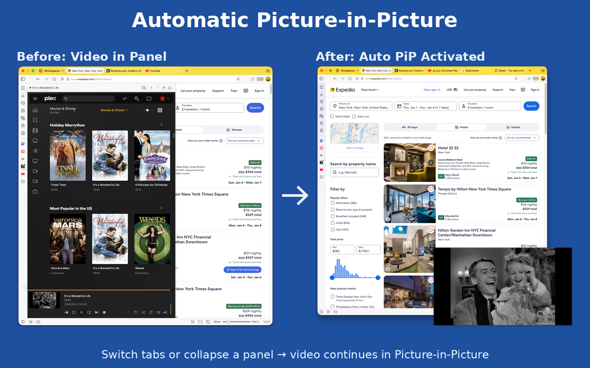

# Better Auto PiP

Automatically enable Picture-in-Picture for videos when switching tabs or collapsing Vivaldi panels. Works with YouTube, Netflix, Plex, Twitch, and more.

## Features

- **Tab Switching**: Automatically enters PiP when you switch away from a video tab
- **Vivaldi Panel Collapse**: Enters PiP when you collapse a Vivaldi panel containing a video
- **Per-Site Controls**: Enable/disable features for specific websites
- **Customizable**: Adjust timing, delays, and behavior to your preferences

## Supported Sites

- YouTube
- Netflix
- Plex
- Twitch
- Hulu
- Vimeo
- Dailymotion
- Crunchyroll
- ESPN
- Microsoft Teams
- Google Meet

## Installation

### From Chrome Web Store
[Link will be added after publication]

### Manual Installation (Development)
1. Clone or download this repository
2. Open Chrome/Vivaldi and navigate to `chrome://extensions`
3. Enable "Developer mode"
4. Click "Load unpacked"
5. Select the `src` folder

## Usage

1. Install the extension
2. Navigate to a supported video site
3. Start playing a video
4. Switch tabs or collapse the panel (Vivaldi only)
5. Video automatically enters Picture-in-Picture mode

## Settings

Access settings by clicking the extension icon or right-clicking and selecting "Options":

- Enable/disable the extension globally
- Configure panel collapse detection (Vivaldi only)
- Adjust tab switch delay
- Per-site enable/disable controls

## License

MIT License - See LICENSE file for details

## Author

**SeanHarsh**
- GitHub: https://github.com/seanharsh/Better-Auto-PiP

## Privacy

This extension does not collect, store, or transmit any user data. All settings are stored locally on your device.